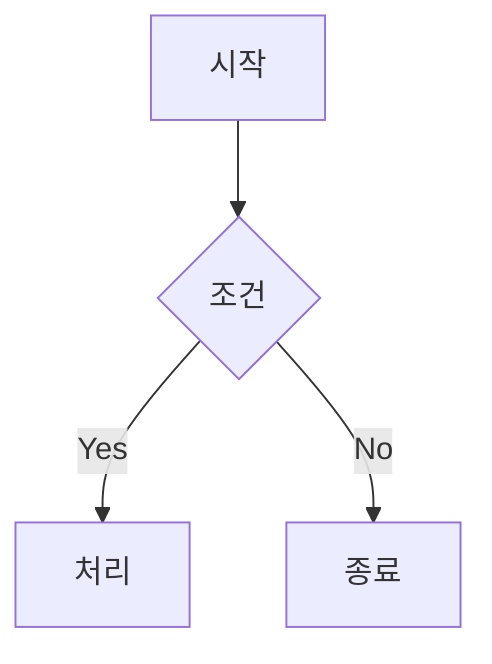

# MarkdownPro v2.0 - Mermaid 지원 마크다운 에디터

Python과 PyQt6로 만든 고급 마크다운 에디터입니다. **Mermaid 다이어그램**을 완벽 지원합니다!

## ✨ 주요 기능

### 📝 마크다운 편집
- **실시간 미리보기**: 작성하면서 바로 결과 확인
- **구문 강조**: 마크다운 문법에 따른 색상 표시
- **자동 완성**: 마크다운 문법 자동 완성
- **찾기/바꾸기**: 텍스트 검색 및 치환

### 📊 Mermaid 다이어그램 (NEW!)
- **실시간 렌더링**: 미리보기에서 다이어그램 즉시 확인
- **전용 뷰어**: 별도 창에서 다이어그램 상세 보기
- **확대/축소**: 25% ~ 400% 줌 지원
- **화면 맞춤**: 전체 차트를 한눈에 보기
- **전체 화면**: F11 또는 버튼으로 전체화면 전환
- **내보내기**: SVG, PNG 형식으로 저장

### 🎨 지원하는 Mermaid 다이어그램
| 타입 | 설명 |
|------|------|
| Flowchart | 플로우차트, 순서도 |
| Sequence | 시퀀스 다이어그램 |
| Class | 클래스 다이어그램 |
| State | 상태 다이어그램 |
| ER | 엔티티 관계도 |
| Gantt | 간트 차트 |
| Pie | 파이 차트 |
| Mindmap | 마인드맵 |
| Git Graph | Git 브랜치 그래프 |

### 🎯 기타 기능
- **다크/라이트 모드**
- **예제 템플릿** (README, 회의록, 블로그 등)
- **테이블/링크/이미지 삽입 도구**
- **이모지 선택기**
- **자동 저장**
- **HTML 내보내기**

## 📦 설치

```bash
# 저장소 다운로드 후
cd markdown-editor

# 가상환경 생성 (권장)
python3 -m venv venv
source venv/bin/activate  # Windows: venv\Scripts\activate

# 의존성 설치
pip install -r requirements.txt

# 실행
python markdown_editor.py
```

## 🚀 Mermaid 사용법

### 기본 사용

에디터에서 Mermaid 코드 블록을 작성하면 미리보기에 자동으로 렌더링됩니다:

~~~markdown

~~~

### Mermaid 뷰어 열기

1. **단축키**: `Ctrl+M`
2. **메뉴**: Mermaid → Mermaid 뷰어 열기
3. **툴바**: 📈 버튼 클릭

### 뷰어 기능

| 기능 | 설명 |
|------|------|
| **줌 인/아웃** | +/- 버튼 또는 슬라이더 |
| **화면 맞춤** | 📐 버튼 - 전체 차트가 화면에 맞게 |
| **실제 크기** | 1:1 버튼 - 100% 원본 크기 |
| **전체 화면** | ⛶ 버튼 또는 F11 |
| **SVG 저장** | 벡터 형식으로 저장 (확대해도 선명) |
| **PNG 저장** | 이미지 형식으로 저장 (2배 해상도) |

### Mermaid 예제 삽입

1. 왼쪽 사이드바에서 **📊 Mermaid** 탭 선택
2. 원하는 다이어그램 유형 선택
3. **에디터에 삽입** 클릭

## ⌨️ 단축키

| 단축키 | 기능 |
|--------|------|
| `Ctrl+N` | 새 문서 |
| `Ctrl+O` | 열기 |
| `Ctrl+S` | 저장 |
| `Ctrl+B` | **굵게** |
| `Ctrl+I` | *기울임* |
| `Ctrl+K` | 링크 삽입 |
| `Ctrl+M` | **Mermaid 뷰어** |
| `Ctrl+1/2/3` | 제목 1/2/3 |
| `Ctrl+F` | 찾기/바꾸기 |
| `F11` | 전체 화면 (뷰어) |
| `Esc` | 전체 화면 종료 |

## 📁 프로젝트 구조

```
markdown-editor/
├── markdown_editor.py   # 메인 프로그램
├── requirements.txt     # 의존성
└── README.md           # 이 파일
```

## 🔧 요구사항

- Python 3.9+
- PyQt6
- PyQt6-WebEngine
- PyQt6-WebChannel

## ⚠️ 문제 해결

### Mermaid가 렌더링되지 않음
- 인터넷 연결 확인 (CDN에서 Mermaid.js 로드)
- PyQt6-WebEngine 설치 확인

### WebEngine 오류
```bash
# Ubuntu/Debian
sudo apt install python3-pyqt6.qtwebengine

# 또는 pip로
pip install PyQt6-WebEngine PyQt6-WebChannel
```

### SVG/PNG 저장이 안됨
- 다이어그램이 완전히 렌더링될 때까지 잠시 대기
- 저장 경로에 쓰기 권한 확인

## 📄 라이선스

MIT License

## 🤝 기여

이슈와 PR을 환영합니다!
