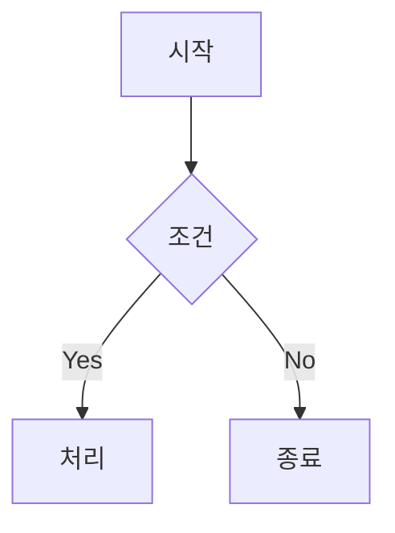

# Nebula Note 1.3

> ✨ Pure & Sexy Markdown Editor - Mermaid 19종 다이어그램 완벽 지원 · 한국어/English/日本語/简体中文

[]()
[]()
[]()

## ✨ 주요 기능

### 📝 마크다운 편집
- **실시간 미리보기** - 작성하면서 바로 결과 확인
- **구문 강조** - 마크다운 문법 색상 구분
- **자동 완성** - 마크다운 문법 자동 제안
- **스니펫** - Tab으로 빠른 텍스트 확장

### 📊 Mermaid 다이어그램 (19종 지원!)

| 카테고리 | 다이어그램 |
|----------|-----------|
| **플로우** | Flowchart (TD/LR), Block Diagram |
| **시퀀스** | Sequence, ZenUML |
| **구조** | Class, ER, C4 Context |
| **상태** | State Diagram |
| **프로젝트** | Gantt, Timeline, User Journey |
| **데이터** | Pie Chart, XY Chart, Sankey, Quadrant |
| **기타** | Mindmap, Git Graph, Requirement |

### 🔍 Mermaid 뷰어
- **확대/축소**: 10% ~ 500%
- **화면 맞춤**: 전체 차트 한눈에 보기
- **전체 화면**: F11 또는 버튼
- **내보내기**: SVG, PNG, PNG @2x (고해상도)

### 🎯 포커스 모드
- 방해 없는 글쓰기 환경
- 메뉴, 툴바, 사이드바 자동 숨김
- 전체 화면 + 최적화된 타이포그래피
- ESC로 빠른 종료

### 📑 문서 관리
- **문서 개요** - 제목 기반 TOC 자동 생성
- **문서 통계** - 단어, 문자, 읽기 시간, 마크다운 요소
- **단어 목표** - 글쓰기 목표 설정 및 진행률
- **백업** - 수동 백업 생성
- **자동 저장** - 1분마다 자동 저장

### 🌏 다국어
- 한국어 · English · 日本語 · 简体中文 UI, 예제 템플릿, Mermaid 예제
- 기본값은 macOS/Windows 시스템 언어, **보기 → 언어** 메뉴로 변경 (재실행 후 적용)
- 번역 문자열: `i18n.py`, 예제 콘텐츠: `localized_content.py`

### 🛠️ 추가 기능
- **다크/라이트 모드**
- **예제 템플릿** - README, 회의록, 블로그 등
- **스니펫 관리** - 커스텀 스니펫 추가/편집
- **찾기/바꾸기** - 정규식 지원
- **테이블/링크/이미지 삽입 도구**
- **이모지 선택기**

## 📦 설치

### 소스에서 실행

```bash
# 저장소 다운로드
cd markdown-editor

# 가상환경 생성 (권장)
python3 -m venv venv
source venv/bin/activate  # Windows: venv\Scripts\activate

# 의존성 설치
pip install -r requirements.txt

# 실행
python markdown_editor.py
```

### Windows EXE 빌드

```powershell
# 의존성 설치
python -m venv venv
.\venv\Scripts\activate
pip install --upgrade pip
pip install -r requirements.txt
pip install pyinstaller

# 실행 파일 빌드 (dist/Nebula Note/Nebula Note.exe 생성)
pyinstaller --noconfirm --windowed --name Nebula Note markdown_editor.py

# 또는 스크립트로 한 번에 실행
build_exe.bat
```

### Windows 설치 파일(NSIS) 빌드

```powershell
# NSIS 설치 후 makensis.exe가 PATH에 있어야 합니다.
# https://nsis.sourceforge.io/Download

# EXE 빌드 + 인스톨러 생성
build_installer.bat

# 결과: dist\NebulaNote-<버전>-Setup.exe, dist\NebulaNote-<버전>-win64.zip
```

### macOS DMG 빌드

```bash
# 빌드 스크립트 실행
chmod +x build_dmg.sh
./build_dmg.sh

# 결과: dist/Nebula Note-<버전>.dmg
```

### Mac App Store 빌드

macOS 미리보기는 시스템 **WKWebView**(PyObjC)를 사용합니다. Qt WebEngine(Chromium)은 private API 사용과
App Sandbox 충돌 때문에 Mac App Store에서 허용되지 않으므로 macOS 빌드에는 포함하지 않습니다(Windows는 Qt WebEngine 사용).

```bash
uv python install 3.12                 # macOS 11+ 대상 standalone Python (Homebrew Python은 최신 macOS 전용)
./build_mas.sh --local-test            # 샌드박스 적용 ad-hoc 서명 앱 (로컬 실행 테스트)
./build_mas.sh                         # 서명 + dist/NebulaNote-<버전>-<빌드>-mas.pkg
ASC_KEY_ID=... ASC_ISSUER_ID=... ./build_mas.sh --upload   # 검증 + App Store Connect 업로드
```

- 프로비저닝 프로파일: `python mas/asc.py ensure-profile com.blueCode.NebulaNote mas/NebulaNote_MAS.provisionprofile`
- 스토어 메타데이터/스크린샷(4개 언어): `fastlane/metadata`, `fastlane/screenshots`
- 버전: `app_version.py` (`APP_VERSION`, MAS 업로드마다 증가하는 `BUILD_NUMBER`)

## 🚀 사용법

### 기본 편집

1. 왼쪽 에디터에서 마크다운 작성
2. 오른쪽 미리보기에서 실시간 확인
3. 툴바 또는 단축키로 서식 적용

### Mermaid 다이어그램

에디터에서 Mermaid 코드 블록 작성:

~~~markdown

```mermaid
flowchart TD
    A[시작] --> B{조건}
    B -->|Yes| C[처리]
    B -->|No| D[종료]
```
~~~

**뷰어 열기**: `Ctrl+M` 또는 툴바 📈 버튼

### 스니펫 사용

트리거 입력 후 `Tab` 키:

| 트리거 | 결과 |
|--------|------|
| `todo` | `- [ ] ` |
| `done` | `- [x] ` |
| `note` | `> **📝 Note:** ` |
| `warn` | `> **⚠️ Warning:** ` |
| `date` | 현재 날짜 |
| `mermaid` | Mermaid 코드 블록 |

## ⌨️ 단축키

| 단축키 | 기능 |
|--------|------|
| `Ctrl+N` | 새 문서 |
| `Ctrl+O` | 열기 |
| `Ctrl+S` | 저장 |
| `Ctrl+Shift+S` | 다른 이름으로 저장 |
| `Ctrl+F` | 찾기/바꾸기 |
| `Ctrl+Z` / `Ctrl+Y` | 실행 취소 / 다시 실행 |
| `Ctrl+1/2/3/4` | 제목 1/2/3/4 |
| `Ctrl+B` | **굵게** |
| `Ctrl+I` | *기울임* |
| `Ctrl+K` | 링크 삽입 |
| `Ctrl+D` | 날짜 삽입 |
| `Ctrl+M` | Mermaid 뷰어 |
| `Ctrl+Shift+C` | 코드 블록 |
| `F11` | 포커스 모드 |
| `Esc` | 포커스 모드 종료 |
| `Tab` | 스니펫 확장 |

### Mermaid 뷰어 단축키

| 단축키 | 기능 |
|--------|------|
| `F11` | 전체 화면 토글 |
| `Esc` | 전체 화면 종료 |
| `+` / `=` | 확대 |
| `-` | 축소 |
| `0` | 100% |

## 📁 프로젝트 구조

```
markdown-editor/
├── markdown_editor.py     # 메인 창, 에디터, 다이얼로그
├── i18n.py                # UI 번역 (ko/en/ja/zh)
├── localized_content.py   # 언어별 Mermaid 예제, 템플릿, 스니펫
├── web_view.py            # 미리보기 웹뷰 (macOS: WKWebView / 기타: Qt WebEngine)
├── preview_html.py        # 미리보기·Mermaid 뷰어 HTML 생성
├── file_io.py             # 샌드박스 대응 사용자 파일 입출력 (QFile)
├── markdown_tools.py      # 표 정렬 등 텍스트 변환
├── mermaid_utils.py       # Mermaid 블록 추출
├── app_version.py         # 앱 버전 (빌드 스크립트 공용)
├── assets/                # 번들 Mermaid / MathJax (오프라인 동작)
├── mas/                   # App Store 엔타이틀먼트, 번들 정리, ASC API 도구
├── fastlane/              # 스토어 메타데이터·스크린샷
├── setup.py               # py2app 빌드 설정
├── build_dmg.sh / build_mas.sh / build_exe.bat
└── tests/                 # unittest
```

## 🔧 설정 파일

| 파일 | 위치 | 내용 |
|------|------|------|
| 설정 | `~/.markdownpro_config.json` | 다크 모드, 최근 파일, 단어 목표 |
| 스니펫 | `~/.markdownpro_snippets.json` | 커스텀 스니펫 |
| 백업 | `~/.markdownpro_backups/` | 수동 백업 파일 |

## 📋 요구사항

- **Python**: 3.9+
- **PyQt6**: 6.4+
- **PyQt6-WebEngine**: Mermaid 렌더링 (QtWebChannel은 PyQt6에 포함)
- **markdown**: 마크다운 변환
- **Pillow**: 아이콘 생성 (빌드용)

## ⚠️ 문제 해결

### Mermaid가 렌더링되지 않음
- 인터넷 연결 확인 (CDN에서 Mermaid.js 로드)
- PyQt6-WebEngine 설치 확인

### macOS 보안 경고
```bash
# 격리 속성 제거
xattr -cr /Applications/Nebula Note.app
```

### WebEngine 오류
```bash
# Ubuntu/Debian
sudo apt install python3-pyqt6.qtwebengine

# pip
pip install PyQt6-WebEngine
```

## 📄 라이선스

MIT License

## 🤝 기여

이슈와 PR을 환영합니다!

---

Made with ❤️ using Python & PyQt6
